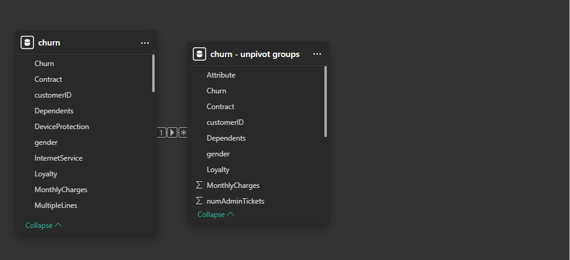

# Customer Retention Dashboard with Power BI

## Overview
This project analyzes customer churn and retention strategies for PhoneNow, a telecom company. The goal is to identify key factors influencing churn and provide actionable insights for improving customer retention.

## Table of Contents
- [Data Model and Structure](#data-model-and-structure)
- [Key Measures in DAX](#key-measures-in-dax)
- [Dashboard Overview](#dashboard-overview)
- [Visualization Breakdown](#visualization-breakdown)
- [Insights and Business Recommendations](#insights-and-business-recommendations)
- [Conclusion](#conclusion)

---

## Data Model and Structure


The dataset consists of two main tables:

1. **Churn Table**: Contains customer details, contract information, services subscribed, and financial data.
2. **Churn - Unpivot Groups Table**: A transformed version for dynamic analysis of attributes like internet service, contract type, and additional features.

### Relationships
- The **Churn Table** and **Churn - Unpivot Groups Table** are linked via the `customerID` field.
- This relationship enables filtering across visualizations when analyzing churn impact based on various attributes.

### Key Columns
- **Churn**: Indicates whether a customer has left the company.
- **Contract**: Specifies contract duration (Month-to-Month, One-Year, Two-Year).
- **Monthly Charges & Total Charges**: Tracks revenue contribution per customer.
- **Internet Service**: Types of internet service subscribed (Fiber Optic, DSL, No Internet).
- **Demographics**: Gender, Senior Citizen, Dependents, and Partner status.

---

## Key Measures in DAX

### Churn Rate Calculation
```DAX
Churn Rate % = 
VAR TotalCustomers = COUNT(Churn[customerID])
VAR ChurnedCustomers = CALCULATE(COUNT(Churn[customerID]), Churn[Churn] = "Yes")
RETURN DIVIDE(ChurnedCustomers, TotalCustomers, 0)
```
## Customer Segmentation Metrics
```DAX
Dependents in % =
VAR TotalCustomers = COUNT(Churn[customerID])
VAR DependentCustomers = CALCULATE(COUNT(Churn[customerID]), Churn[Dependents] = "Yes")
RETURN DIVIDE(DependentCustomers, TotalCustomers, 0)
```
## Financial Metrics
```DAX
Average Monthly Charges = AVERAGE(Churn[MonthlyCharges])
```
# Customer Retention Dashboard

## Dashboard Overview

### Home Page  
  

### Churn Analysis Dashboard  
  

### Customer Risk Analysis Dashboard  
  
  
[View the Interactive Dashboard](https://app.powerbi.com/view?r=eyJrIjoiZjEzODlkMTktODVmYy00NjAyLTk1NzgtZDI3OTIzY2RlZTEwIiwidCI6ImRmODY3OWNkLWE4MGUtNDVkOC05OWFjLWM4M2VkN2ZmOTVhMCJ9)  


## Visualization Breakdown

## Key Performance Indicators (KPIs)
7043 Customers at Risk
$16.06M Yearly Charges
26.54% Churn Rate
## Demographics Analysis
Gender Split: 49.5% Male, 50.5% Female.
Senior Citizens: 25% of customers.
Dependents: 17% of customers have dependents.
## Service and Subscription Analysis
Multiple Lines Subscription: 50.03% Yes, 49.97% No.
Streaming TV & Movies: Both at 44%.
Online Security: 16% adoption rate.
Contract Type
55% Month-to-Month
24% Two-Year
21% One-Year
## Churn Risk Factors
 # Churn Rate by Internet Service
Fiber Optic: 41.89%
DSL: 18.96%
No Internet: 7.40%
Churn by Contract Type
Month-to-Month contracts show the highest churn rate.

## Insights and Business Recommendations
Key Observations
High churn in Month-to-Month contracts suggests customers need better retention incentives.

Electronic check users have higher churn rates, indicating potential payment issues.

Fiber optic customers have the highest churn, possibly due to service-related dissatisfaction.
## Actionable Recommendations
Increase customer loyalty programs for Month-to-Month contracts to encourage longer commitments.

Improve support for Fiber Optic customers to reduce dissatisfaction.

Encourage Auto-Payments to reduce churn caused by payment failures.

Expand Tech Support Capacity to minimize customer frustration.

## Conclusion
This Power BI report provides valuable insights into customer churn trends, enabling PhoneNow to take proactive steps to improve retention. The combination of demographics, financial metrics, and service adoption rates helps pinpoint key risk factors and guide business decisions.
